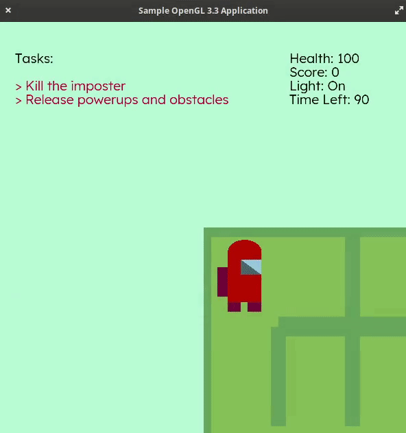

# Among Us Lite

This is an OpenGL based 2D game inspired from the amazing Among Us game. The challenge for you is to find the exit of the maze within a limited time frame. You will be allowed to exit only when you complete all the tasks. There is a imposter hunting for you in the game. Hence you need to escape away from the imposter and kill him in order to survive. Turning lights off(poor visibility), collecting coins, and avoiding bomb, yes there is a lot of stuff waiting for you. So why not give this a try!

<p align="center" width="100%">
     
</p>

## Instructions

- Create a folder called "build", situated at the root of the directory.
- Move inside "build" folder and run following commands:

```bash
cd build/
cmake ..
make
./among-us
```

- Upon running among-us, our application will get launched.

## Gameplay

- The world is a 2d maze generated randomly by <b>Kruskal's algorithm</b>. The player can move among the blocks which does not contain a wall in between.
- The player as well imposter is a 2D figure of an Among Us character. This character can perform movements in four directions: top, bottom, left, right.
- In order to win the game, the player has to solve the following two tasks and reach the end of the maze within a fixed time period.
  - Kill the imposter
  - Release powerups and obstacles
- There will be two toned squares blocks representing the buttons which needs to be visited in order to complete these tasks.
- The player will lose the game when:
  - The time runs out
  - Imposter kills the player
- The imposter will search for the player using <b>BFS and backtracking algorithm</b>, and thus, move towards the player.
- The health will start reducing exponentially once the imposter overlaps with player. Hence in order to stay alive, the player needs to quickly move away from the imposter.
- If player completes the task of releasing powerups and obstacles, then the maze will get filled with yellow and grey colored blocks, representing coin and bomb. If player collects coin, his score will increase by 1, and if player collects a bomb, his score will decrease by 1.
- There also exists a mode which allows you to turn off lights (blind mode). Hence only the next nearest reachable blocks will be visible to the player. Also, there is a score multiplier which increase with the increase in duration of blind mode. This score mmultiplier gets multiplied with the value of coin, as soon as the player grabs one. When blind mode is turned off (i.e. when the lights are turned on), the score multiplier resets to 1.

<p align="center" width="100%">
     
</p>

### Keys:

- `W`: To move the player to the top block
- `A`: To move the player to the left block
- `S`: To move the player to the bottom block
- `D`: To move the player to the right block
- `C`: To turn off lights, i.e. to turn on blind mode
- `V`: To turn on lights, i.e. to turn off blind mode
- `O`: To turn on world camera view, i.e. to turn off first person view
  - `I`: To move camera to top
  - `J`: To move camera to left
  - `K`: To move camera to bottom
  - `L`: To move camera to right
  - `M`: To zoom out
  - `N`: To zoom in
- `P`: To turn off world camera view, i.e. to turn on first person view
- `ESC` or `Q`: To quit the application

## Dependencies:

- C++
- glad
- glfw
- glm
- glew
- freetype

# Machine Specifications

Details of the machine on which the application was tested:

- Operating System: Elementary OS 5.1 (Hera)
- Terminal: Bash
- Processor: Intel Core i7-8750H CPU @ 2.20 GHz 2.21 GHz
- RAM: 16 GB
